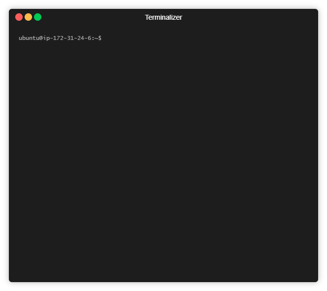

# Get started

## Setting SugoiJS application

Setting a SugoiJS application is only three steps away.



### Installing @sugoi/cli

```bash
$ npm i -g @sugoi/cli
```

### Run SugoiJS initialization wizard

Use the initialization wizard to define your needs.

```bash
$ sugoi init <app name> && cd <app name>/server
```

**Or**

```bash
$ sgi init <app name> && cd <app name>/server
```

### Install & Run

All you left to do is to install the packages and run your server!

```bash
$ npm i && npm start
```

#### Development command \(live reload\)

For using the live reload feature you need to

1. Build with watch by using the `dev` action - command session won't get closed

```bash
npm run dev
```

   2. Run the server with `nodemon` - command session won't get closed

```bash
npm run start:watch
```

### Enjoy your new server

As soon you will done the installation you should be able to reach  
`http://localhost:3000` for reach the client application and`http://localhost:3000/index` for reach the API endpoint.

## File structure

```text
├───client        <-- Your web client application directory
│   └───assets
├───common        <-- Common (shared) files between client and server
└───server        <-- Your SugoiJS server directory
    ├───config    <-- Build config (environment, webpack)
    │   └───webpack
    └───src       <-- Your server app source code
        ├───app   <-- Bootstrap module, Server initialize and listener files, 'authorization' class(optional)
        │   └───classes
        ├───config     <-- Server configuration (services, paths, etc.)
        └───modules    <-- All of you application modules
            └───index  <-- Single module
                ├───controllers    <-- Modules' controllers
                ├───models         <-- Modules' models(optional)
                └───services       <-- Modules' services
```

