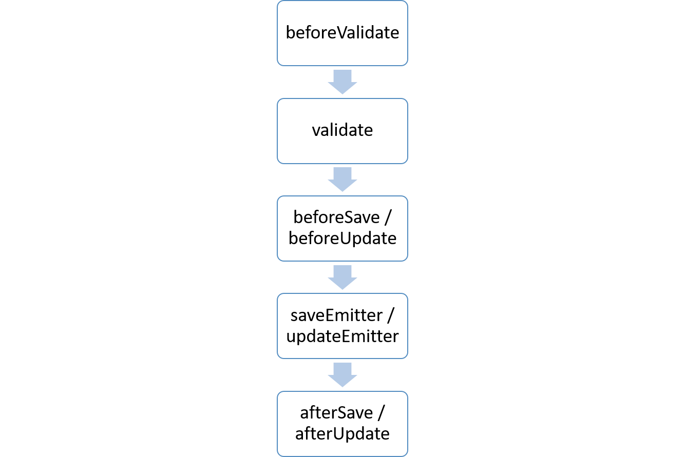
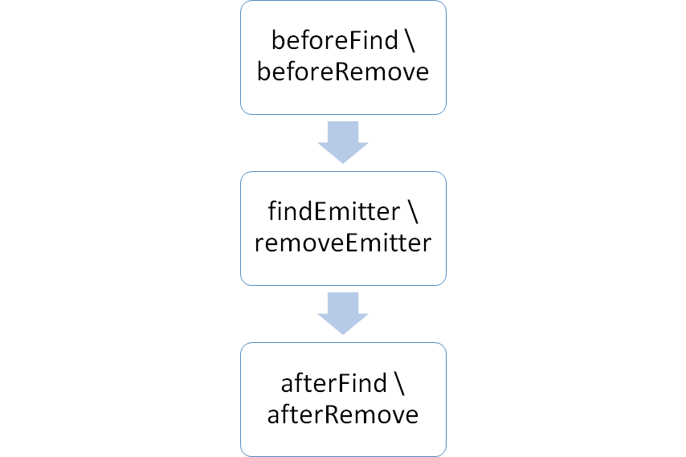

# Lifecycle

## Overview

SugoiJS ORM uses pre-defined model lifecycle hooks which apply during the CRUD calls.

### Save & Update

The save & update hooks can be implemented using the following interfaces:

1. IBeforeValidate
2. IValidate
3. IBeforeSave / IBeforeUpdate
4. IAfterSave / IAfterUpdate

### Find & Remove

The find & remove hooks can be implemented using the follow interfaces:

1. IBeforeFind/IBeforeRemove
2. IAfterFind/IAfterRemove

